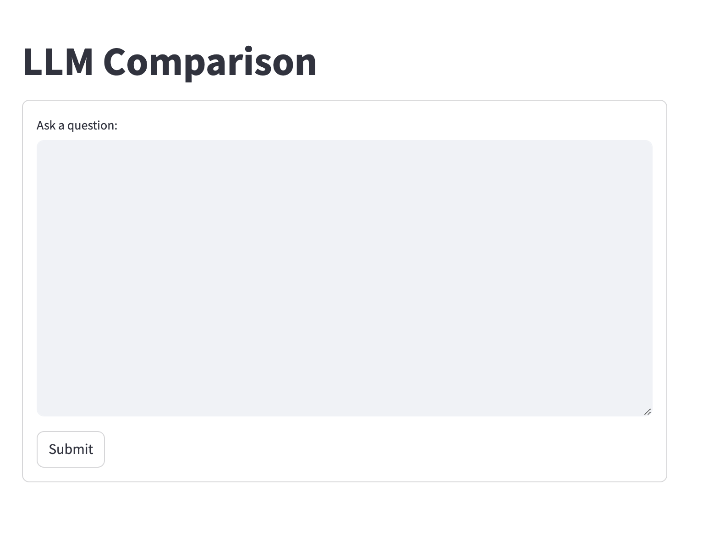
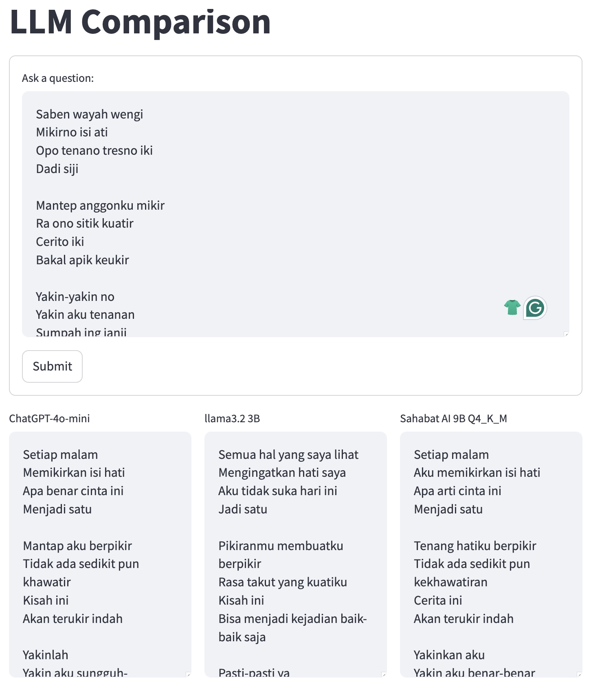
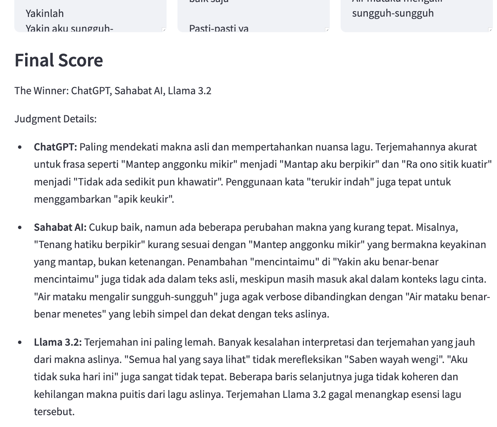

# LLM Comparison App

This Streamlit application provides a comparative analysis of different language models' performance in translating and processing text. It allows users to input text and compare responses from **ChatGPT-4o-mini**, **llama3.2 3B**, and **Sahabat AI 9B**.

---

## Features

- **Translation-focused Tasks**: Designed to translate between Javanese and Indonesian, or vice versa.
- **Multi-LLM Comparison**: Simultaneously evaluates the output of three models.
- **Custom Scoring**: Uses a critical judge (via Google Gemini) to determine the best translation and provide detailed reasoning.
- **Interactive Interface**: Easy-to-use form-based input and structured display of results.

---

## Installation

### Prerequisites
- Python 3.12 or higher
- `pip` for dependency installation
- `streamlit` for web interface
- Environment variable `.env` file for API configurations

### Steps

1. **Clone the repository**:
   ```bash
   git clone https://github.com/your-repo/llm-comparison-app.git
   cd llm-comparison-app
   ```

2. **Install dependencies**:
   ```bash
   pip install -r requirements.txt
   ```

3. **Set up environment variables**:
   Create a `.env` file with the following variables:
   ```env
   LLAMA_URL=http://<your-llama-url>
   SAHABAT_URL=http://<your-sahabat-ai-url>
   GOOGLE_API_KEY=YOUR-KEY
   OPENAI_API_KEY=YOUR-KEY
   ```

4. **Run the app**:
   ```bash
   streamlit run app.py
   ```

---

## Usage

1. Launch the app and enter the text to translate in the provided text area.
2. Click **Submit** to process the input.
3. View results in three columns, showing outputs from:
   - **ChatGPT-4o-mini**
   - **llama3.2 3B**
   - **Sahabat AI 9B**
4. Review the **Final Score**, which includes:
   - A ranked list of models based on the judgment.
   - Detailed explanations of why a particular model was chosen as the best.
---

## Screenshots

1. **Main Interface**:<br>
   

2. **Model Outputs**:<br>
   

3. **Judgment Score**:<br>
   

---

## License

This project is licensed under the MIT License. See the `LICENSE` file for details.
